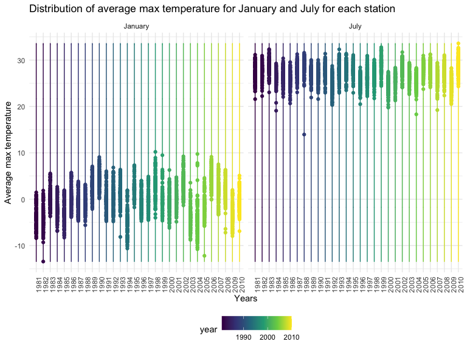
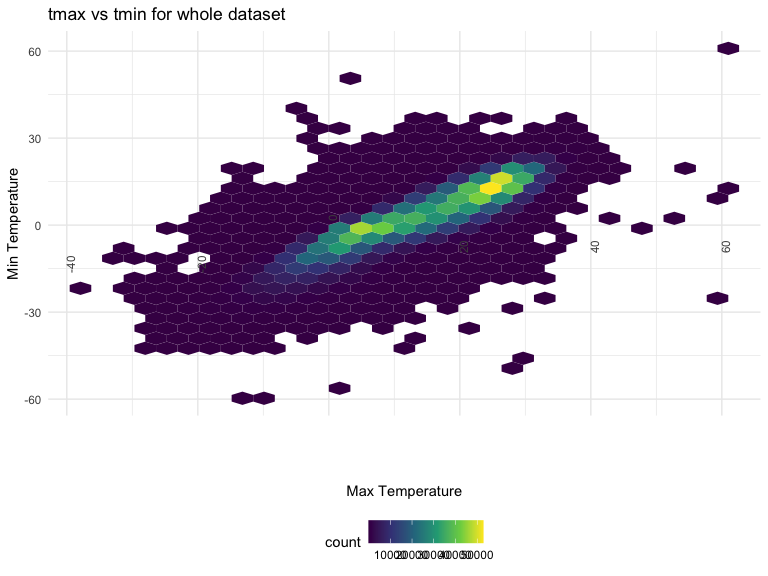
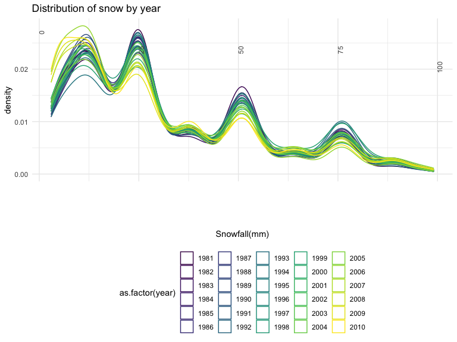

p8105_hw3_gl2761
================
Gonghao Liu
10/15/2022

### Problem 1

#### Read in the data

``` r
data("instacart")

instacart = 
  instacart %>% 
  as_tibble(instacart)
```

#### Answer questions about the data

This dataset contains 1384617 rows and 15 columns, with each row
resprenting a single product from an instacart order. Variables include
identifiers for user, order, and product; the order in which each
product was added to the cart. There are several order-level variables,
describing the day and time of the order, and number of days since prior
order. Then there are several item-specific variables, describing the
product name (e.g. Yogurt, Avocado), department (e.g. dairy and eggs,
produce), and aisle (e.g. yogurt, fresh fruits), and whether the item
has been ordered by this user in the past. In total, there are 39123
products found in 131209 orders from 131209 distinct users.

Below is a table summarizing the number of items ordered from aisle. In
total, there are 134 aisles, with fresh vegetables and fresh fruits
holding the most items ordered by far.

``` r
instacart %>% 
  count(aisle) %>% 
  arrange(desc(n))
```

    ## # A tibble: 134 × 2
    ##    aisle                              n
    ##    <chr>                          <int>
    ##  1 fresh vegetables              150609
    ##  2 fresh fruits                  150473
    ##  3 packaged vegetables fruits     78493
    ##  4 yogurt                         55240
    ##  5 packaged cheese                41699
    ##  6 water seltzer sparkling water  36617
    ##  7 milk                           32644
    ##  8 chips pretzels                 31269
    ##  9 soy lactosefree                26240
    ## 10 bread                          23635
    ## # … with 124 more rows

Next is a plot that shows the number of items ordered in each aisle.
Here, aisles are ordered by ascending number of items.

``` r
instacart %>% 
  count(aisle) %>% 
  filter(n > 10000) %>% 
  mutate(aisle = fct_reorder(aisle, n)) %>% 
  ggplot(aes(x = aisle, y = n)) + 
  geom_point() + 
  labs(title = "Number of items ordered in each aisle") +
  theme(axis.text.x = element_text(angle = 60, hjust = 1))
```


Our next table shows the three most popular items in aisles
`baking ingredients`, `dog food care`, and `packaged vegetables fruits`,
and includes the number of times each item is ordered in your table.

``` r
instacart %>% 
  filter(aisle %in% c("baking ingredients", "dog food care", "packaged vegetables fruits")) %>%
  group_by(aisle) %>% 
  count(product_name) %>% 
  mutate(rank = min_rank(desc(n))) %>% 
  filter(rank < 4) %>% 
  arrange(desc(n)) %>%
  knitr::kable()
```

| aisle                      | product_name                                  |    n | rank |
|:---------------------------|:----------------------------------------------|-----:|-----:|
| packaged vegetables fruits | Organic Baby Spinach                          | 9784 |    1 |
| packaged vegetables fruits | Organic Raspberries                           | 5546 |    2 |
| packaged vegetables fruits | Organic Blueberries                           | 4966 |    3 |
| baking ingredients         | Light Brown Sugar                             |  499 |    1 |
| baking ingredients         | Pure Baking Soda                              |  387 |    2 |
| baking ingredients         | Cane Sugar                                    |  336 |    3 |
| dog food care              | Snack Sticks Chicken & Rice Recipe Dog Treats |   30 |    1 |
| dog food care              | Organix Chicken & Brown Rice Recipe           |   28 |    2 |
| dog food care              | Small Dog Biscuits                            |   26 |    3 |

Finally is a table showing the mean hour of the day at which Pink Lady
Apples and Coffee Ice Cream are ordered on each day of the week. This
table has been formatted in an untidy manner for human readers. Pink
Lady Apples are generally purchased slightly earlier in the day than
Coffee Ice Cream, with the exception of day 5.

``` r
instacart %>%
  filter(product_name %in% c("Pink Lady Apples", "Coffee Ice Cream")) %>%
  group_by(product_name, order_dow) %>%
  summarize(mean_hour = mean(order_hour_of_day)) %>%
  spread(key = order_dow, value = mean_hour) %>%
  knitr::kable(digits = 2)
```

    ## `summarise()` has grouped output by 'product_name'. You can override using the
    ## `.groups` argument.

| product_name     |     0 |     1 |     2 |     3 |     4 |     5 |     6 |
|:-----------------|------:|------:|------:|------:|------:|------:|------:|
| Coffee Ice Cream | 13.77 | 14.32 | 15.38 | 15.32 | 15.22 | 12.26 | 13.83 |
| Pink Lady Apples | 13.44 | 11.36 | 11.70 | 14.25 | 11.55 | 12.78 | 11.94 |

### Problem 2

``` r
accel_df = read_csv("accel_data.csv")
```

    ## Rows: 35 Columns: 1443
    ## ── Column specification ────────────────────────────────────────────────────────
    ## Delimiter: ","
    ## chr    (1): day
    ## dbl (1442): week, day_id, activity.1, activity.2, activity.3, activity.4, ac...
    ## 
    ## ℹ Use `spec()` to retrieve the full column specification for this data.
    ## ℹ Specify the column types or set `show_col_types = FALSE` to quiet this message.

``` r
accel_clean = accel_df %>% 
  janitor::clean_names() %>% 
  mutate(
    weekday_weekend = case_when(
    day == "Monday" ~ "Weekday",
    day == "Tuesday" ~ "Weekday",
    day == "Wednesday" ~ "Weekday",
    day == "Thursday" ~ "Weekday",
    day == "Friday" ~ "Weekday",
    day == "Saturday" ~ "Weekend",
    day == "Sunday" ~ "Weekend",
  ),
  day = as.factor(day),
  day = fct_relevel(day,
                    c("Monday", "Tuesday", "Wednesday", "Thursday", 
                      "Friday", "Saturday", "Sunday"))) %>% 
  relocate(week, day_id, day, weekday_weekend) %>% 
  pivot_longer(
    activity_1:activity_1440,
    names_to = "activity_min",
    names_prefix = "activity_",
    values_to = "activity_counts"
  ) %>% 
  mutate(
    activity_min = as.numeric(activity_min),
    weekday_weekend = as.factor(weekday_weekend)
    )
```

Description of resulting dataset: This data set has 6 variables and
50400 observations.

Variables are week, day_id, day, weekday_weekend, activity_min,
activity_counts.

Here are variable descriptions:

week: Number of week.

day_id: Number of day.

day: the day that related to day_id.

weekday_weekend: Whether it is a weekday or weekend.

activity_min: Each activity minute.

activity_counts: The counts on each activity minute.

``` r
accel_clean %>% 
  group_by(week, day) %>% 
  summarise(total_activity = sum(activity_counts),
            .groups = "drop") %>% 
  pivot_wider(
    names_from = day,
    values_from = total_activity
  ) %>% 
  knitr::kable(caption = "Total activity data over the day") 
```

| week |    Monday |  Tuesday | Wednesday | Thursday |   Friday | Saturday | Sunday |
|-----:|----------:|---------:|----------:|---------:|---------:|---------:|-------:|
|    1 |  78828.07 | 307094.2 |    340115 | 355923.6 | 480542.6 |   376254 | 631105 |
|    2 | 295431.00 | 423245.0 |    440962 | 474048.0 | 568839.0 |   607175 | 422018 |
|    3 | 685910.00 | 381507.0 |    468869 | 371230.0 | 467420.0 |   382928 | 467052 |
|    4 | 409450.00 | 319568.0 |    434460 | 340291.0 | 154049.0 |     1440 | 260617 |
|    5 | 389080.00 | 367824.0 |    445366 | 549658.0 | 620860.0 |     1440 | 138421 |

Total activity data over the day

I don’t think there seem to be any trends in the existing data.

``` r
accel_clean %>% 
  ggplot(aes(x = activity_min,y = activity_counts,color = day)) +
  geom_point(alpha = .5) +
  labs(
    title = "24_hour activity time courses for eah day",
    x = "Time of the day",
    y = "Activity time counted"
  ) +
  viridis::scale_color_viridis(
    name = "Day",
    discrete = TRUE) +
    scale_x_continuous(
    breaks = c(0, 120, 240, 360, 480, 600, 720, 840, 960, 1080, 1200, 1320, 1440),
    labels = c("0h", "2h", "4h", "6h", "8h", "10h", "12h", "14h", 
               "16h", "18h", "20h", "22h", "24h")
  ) +
  theme(plot.title = element_text(hjust = .5))
```


Based on the graph above, we can see that this patient starts to be
active around 7 am, around noon, around 4:30 pm on Thursday, Saturday
and Sunday, and is active around 9 pm on most days except Sunday.

### Problem 3

``` r
data("ny_noaa")
skimr::skim(ny_noaa)
```

|                                                  |         |
|:-------------------------------------------------|:--------|
| Name                                             | ny_noaa |
| Number of rows                                   | 2595176 |
| Number of columns                                | 7       |
| \_\_\_\_\_\_\_\_\_\_\_\_\_\_\_\_\_\_\_\_\_\_\_   |         |
| Column type frequency:                           |         |
| character                                        | 3       |
| Date                                             | 1       |
| numeric                                          | 3       |
| \_\_\_\_\_\_\_\_\_\_\_\_\_\_\_\_\_\_\_\_\_\_\_\_ |         |
| Group variables                                  | None    |

Data summary

**Variable type: character**

| skim_variable | n_missing | complete_rate | min | max | empty | n_unique | whitespace |
|:--------------|----------:|--------------:|----:|----:|------:|---------:|-----------:|
| id            |         0 |          1.00 |  11 |  11 |     0 |      747 |          0 |
| tmax          |   1134358 |          0.56 |   1 |   4 |     0 |      532 |          0 |
| tmin          |   1134420 |          0.56 |   1 |   4 |     0 |      548 |          0 |

**Variable type: Date**

| skim_variable | n_missing | complete_rate | min        | max        | median     | n_unique |
|:--------------|----------:|--------------:|:-----------|:-----------|:-----------|---------:|
| date          |         0 |             1 | 1981-01-01 | 2010-12-31 | 1997-01-21 |    10957 |

**Variable type: numeric**

| skim_variable | n_missing | complete_rate |  mean |     sd |  p0 | p25 | p50 | p75 |  p100 | hist  |
|:--------------|----------:|--------------:|------:|-------:|----:|----:|----:|----:|------:|:------|
| prcp          |    145838 |          0.94 | 29.82 |  78.18 |   0 |   0 |   0 |  23 | 22860 | ▇▁▁▁▁ |
| snow          |    381221 |          0.85 |  4.99 |  27.22 | -13 |   0 |   0 |   0 | 10160 | ▇▁▁▁▁ |
| snwd          |    591786 |          0.77 | 37.31 | 113.54 |   0 |   0 |   0 |   0 |  9195 | ▇▁▁▁▁ |

Clean the data

``` r
ny_noaa_clean = 
  ny_noaa %>%
  janitor::clean_names()%>%
  separate(date, into = c("year", "month", "day"))%>%
  mutate(
    year = as.integer(year),
    month = as.integer(month),
    month = month.name[month],
    day = as.integer(day),
    tmax = as.numeric(tmax)/10,
    prcp = as.numeric(prcp)/10,
    tmin = as.numeric(tmin)/10
    )%>%
  relocate(year, month, day) 
```

``` r
ny_noaa_clean %>%
  count(snow) %>%
  arrange(desc(n))
```

    ## # A tibble: 282 × 2
    ##     snow       n
    ##    <int>   <int>
    ##  1     0 2008508
    ##  2    NA  381221
    ##  3    25   31022
    ##  4    13   23095
    ##  5    51   18274
    ##  6    76   10173
    ##  7     8    9962
    ##  8     5    9748
    ##  9    38    9197
    ## 10     3    8790
    ## # … with 272 more rows

The most commonly observed value for the snow variable is 0 because most
of the weather stations didn’t observe snow most of the time.

``` r
ny_noaa_clean %>% 
  filter(month %in% c('January', 'July')) %>%
  filter(!is.na(tmax)) %>% 
  group_by(month, year, id) %>% 
  summarise(mean_temp = mean(tmax)) %>% 
  ggplot(aes(x = as.factor(year), y=mean_temp, color = year)) +
  geom_point() +
  geom_density(alpha = .5) +
  facet_grid(.~ month) +
  labs(
    title = "Distribution of average max temperature for January and July for each station",
    x = "Years",
    y = "Average max temperature",
  ) +
  theme(axis.text.x = element_text(angle = 90, hjust = 5))
```

    ## `summarise()` has grouped output by 'month', 'year'. You can override using the
    ## `.groups` argument.



The average temperature in July is higher than in January. In 1982 there
is a day in January that is extremely cold day. In 1988 there is a day
much cooler than usual.

``` r
ny_noaa_clean%>%
  filter(!is.na(tmax)| !is.na(tmin)) %>% 
  ggplot(aes(x = tmax, y = tmin)) + 
  geom_hex() +
  labs(
    title = "tmax vs tmin for whole dataset",
    x = "Max Temperature",
    y = "Min Temperature",
  ) +
  theme(axis.text.x = element_text(angle = 90, hjust = 5))
```



Tmax vs Tmin has the most density in the region of (0,0) and (15,25).

``` r
ny_noaa_clean%>%
  filter(!is.na(snow)) %>%
  filter(snow>0 & snow<100)%>%
  group_by(year)%>%
  ggplot(aes(x=snow, color=as.factor(year))) +
  geom_density(alpha=0.5)+
  labs(
    title = "Distribution of snow by year",
    x = "Snowfall(mm)"
  ) +
  theme(axis.text.x = element_text(angle = 90, hjust = 5))
```



According to the graph above, the snowfall density has a similar trend
in all the years. Snowfall gets to it’s largest density around 12mm and
25mm.
